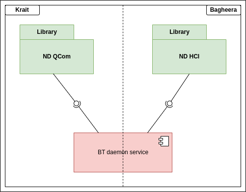
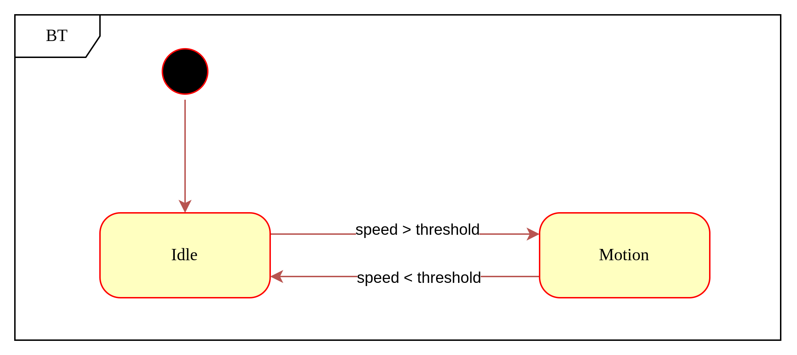
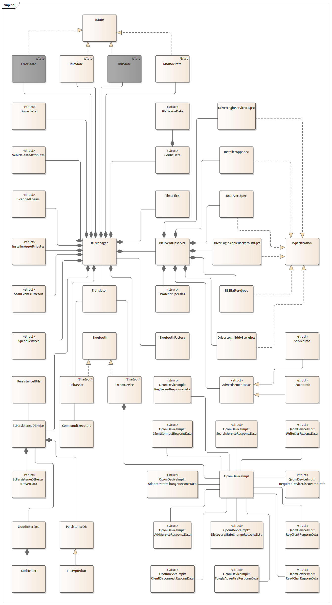

## nd bluetooth service

nd_bt is responsible for interacting with Bluetooth module and handling the business logic around it.

## Coding Guidelines

We follow the [Google C++ Style Guide](https://google.github.io/styleguide/cppguide.html) for our C++ code. Please refer to the documentation for detailed guidelines on formatting, naming conventions, and other coding practices.

## Components

- [nd_bt_man](src/daemon/nd_bt_man.cpp) - daemon
- [libndbt.so](src/lib/) - library that abstracts BT module calls

## Component Diagram



## State Diagram



## Static Design



## Build and install

To build this project, follow these steps:

# Native environment

```bash
  git clone <URL>
  mkdir build
  cd build
  cmake .. -DFOR_TARGET=<name>    Example <name>: BAGHEERA2
  make
```

# Crosscompiler environment

```bash
  git clone <URL>
  mkdir build
  cd build
  cmake .. -DFOR_TARGET=<name> -DCMAKE_TOOLCHAIN_FILE=../krait64_toolchain.cmake Example <name>: BAGHEERA2 / KRAIT
  make
```

Binaries are located under ``build/src/daemon/<component>``
Libraries are located under ``build/src/lib/<component>``

## Preferred Cmake version

nd_bt and nd_sam services are build with cmake. And for krait since it is cross_compiler cmake version 3.10.2 which is a default version of ubuntu18.04 is not compatible.
Hence cmake version has to be updated to cmake_3.16.3
This cmake version is downloaded from  https://github.com/Kitware/CMake/releases/download/v3.16.3/cmake-3.16.3-Linux-x86_64.tar.gz
This can be extracted and soft-linked to /usr/bin/cmake

## Reference

[Bluetooth Redesign](https://netradyne.atlassian.net/wiki/spaces/DSW/pages/261914655/Bluetooth+Redesign)

## Authors

- [@SunilKS-nd ](https://github.com/SunilKS-nd)
