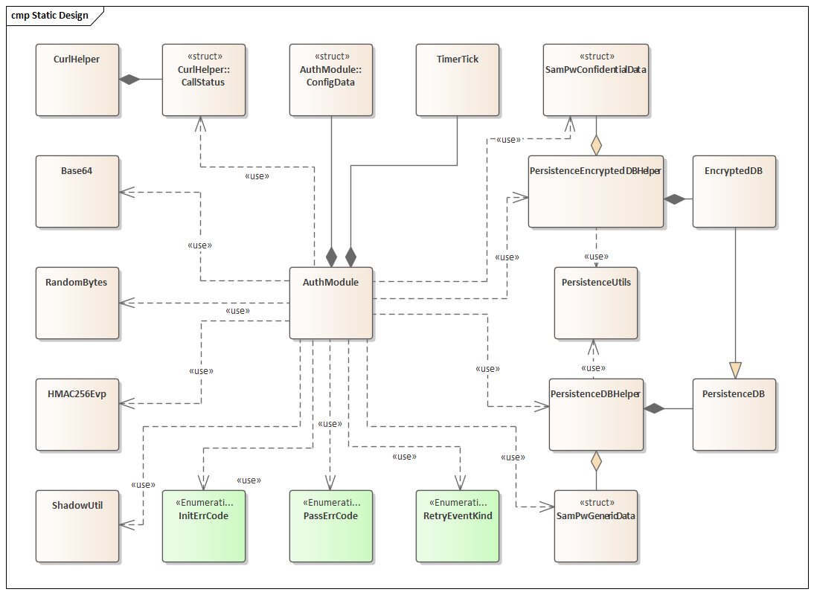
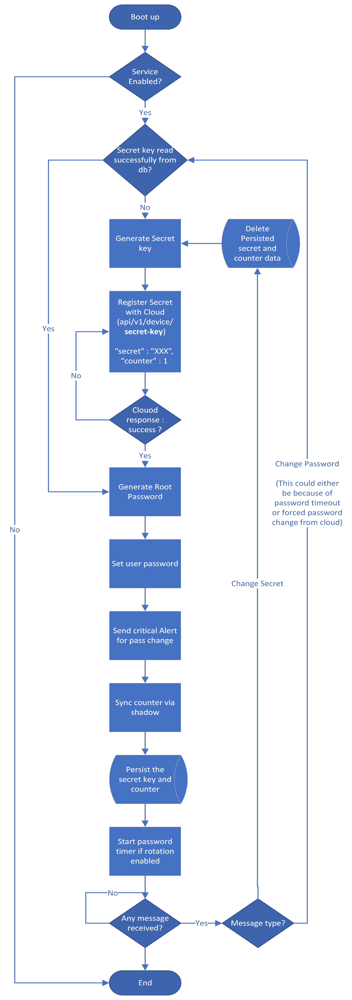

# nd security auth module

nd_sam is responsible for updating passwords using [HOTP](https://en.wikipedia.org/wiki/HMAC-based_one-time_password) algorithm on need basis or in a timely manner.

## Coding Guidelines

We follow the [Google C++ Style Guide](https://google.github.io/styleguide/cppguide.html) for our C++ code. Please refer to the documentation for detailed guidelines on formatting, naming conventions, and other coding practices.

## Components

- [nd_sam](src/daemon/nd_sam.cpp) - daemon
- [nd_sam_cli](src/console/sam_cli.cpp) - CLI tool to interact with daemon

## Static Design



## Flow Chart


## Build and install

To build this project, follow these steps:

```bash
  git clone <URL>
  mkdir build
  cd build
  cmake .. -DFOR_TARGET=<name>    Example: BAGHEERA2
  make
```
Binaries are located under ```build/src/<component>```

## Authors

- [@SunilKS-nd ](https://github.com/SunilKS-nd)
